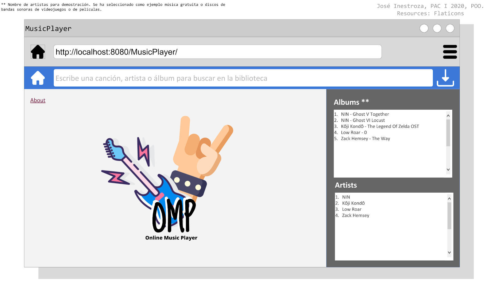
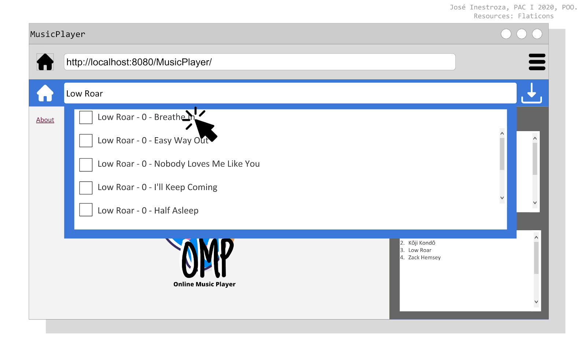
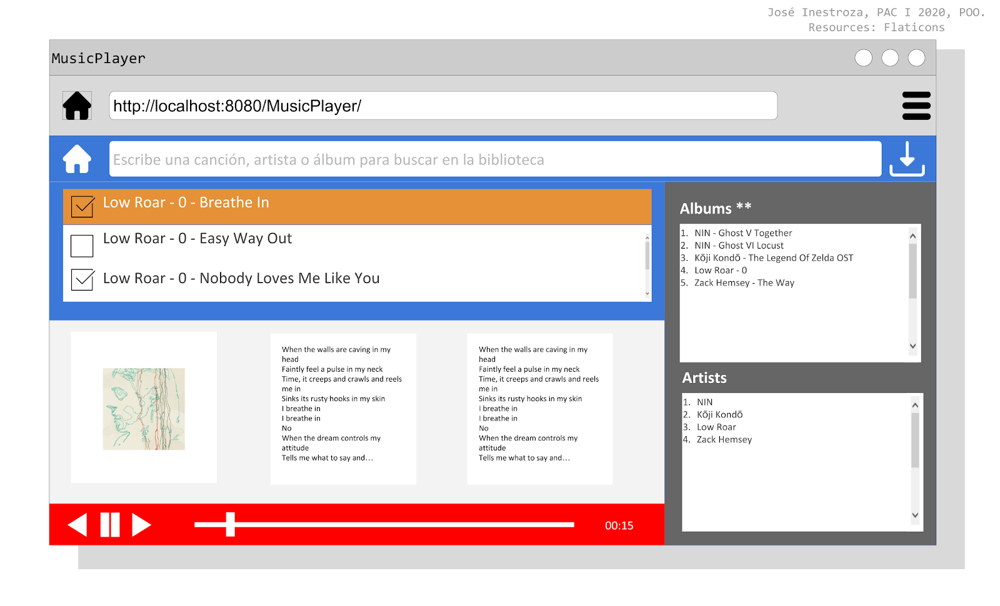

# Proyecto 2 Reproductor de audio en la web
### Programación Orientada a Objetos*, Ingeniería en Sistemas, Facultad de Ingeniería, Universidad Nacional Autónoma de Honduras.

## Definición de proyecto
### objetivos*:
* Hacer un reproductor MP3 en el navegador Web usando etiquetas de audio HTML5 que permita cargar la librería de música detectada en un directorio específico del servidor, mostrar la letra de la canción que se escucha leyendo API’s/HTML’s en la Web, cargando una imagen del arte del álbum desde el folder de canciones en el disco duro y permitiendo descargar canciones desde el sitio web.
* Cada equipo centralizará su desarrollo en la POO, el AOO, el DOO, el uso de la Web, el uso de la Web para multimedia, la programación orientada a objetos en la Web, la consulta de servicios o páginas Web desde su aplicación, la Web compatible con múltiples navegadores y el manejo dinámico de archivos que se encuentran en el disco duro. Su juego será probado en un navegador Desktop y en un navegador Móvil.
* Su Mp3 Player en la Web leerá dinámicamente  las canciones desde el disco duro. Todas la canciones que se encuentren en el directorio Library o en alguno de sus subdirectorios se debe mostrar como una canción en la aplicación Web. Debe existir un buscador de texto con el cual pueda buscar canciones por nombre, álbum o artista usando un único campo de texto en la parte superior de la pantalla principal. Cuando se escuche una canción, el arte asociado con el álbum se debe mostrar en pantalla (la imagen del arte debe encontrarse en la Librería de canciones).
* Al escuchar una canción, su aplicación de forma dinámica y asíncrona deberá buscar la letra de dicha canción y mostrarla en la pantalla. La aplicación mostrará dos versiones de la letra, una usando un API de lyrics en internet (el cual debe ser investigado por el estudiante), y la segunda versión usando un HTML site del cual el sistema descargará la letra y la parseará para mostrarla en pantalla. Su aplicación deberá mostrar secciones de “Cargando” cada vez que haga una petición y la información aún no está disponible para mostrarse. La consulta del API y del HTML site deben hacerse desde los controladores Java.
* Usando sesiones, la interfaz deberá permitir seleccionar una o muchas canciones de diferentes artistas y deberá permitir al usuario descargar dichas canciones mediante un ZIP. La generación del ZIP debe hacerse mediante sub-procesos hacia un programa Python en Linux.
* El audio debe poder reproducirse en la página web haciendo uso de la etiqueta nativa de audio de HTML5.
* Su proyecto es de investigación y desarrollo, aplicando las teorías y temas de la asignatura.
* La calificación de su proyecto será entregada de acuerdo con la calidad funcional, la calidad visual, la implementación orientada a objetos, la implementación de objetos en la web, y sobre el cumplimiento de los requerimientos que se listan en este documento.

### Arte visual de apoyo*:
Pantalla de inicio

Acción de buscar

Acción de reproducción

>El arte visual propuesto sirve únicamente como guía para los estudiantes.

__* Clase impartida por el ingeniero José Inestroza y de su autoría son los objetivos y el arte visual presentado.__